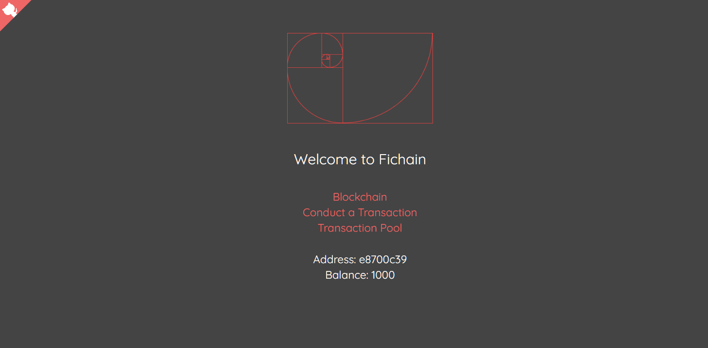
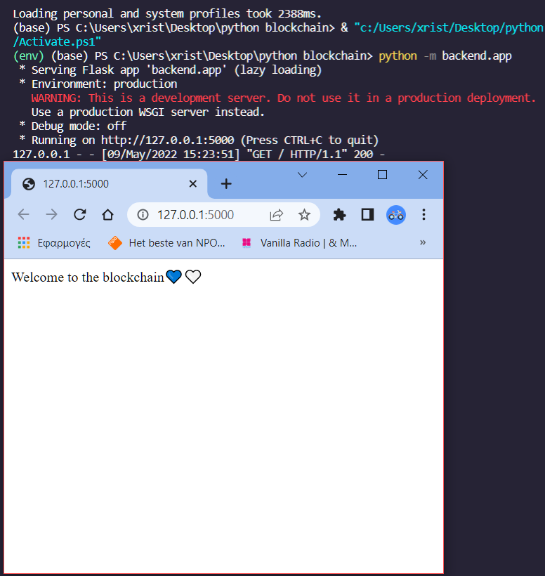
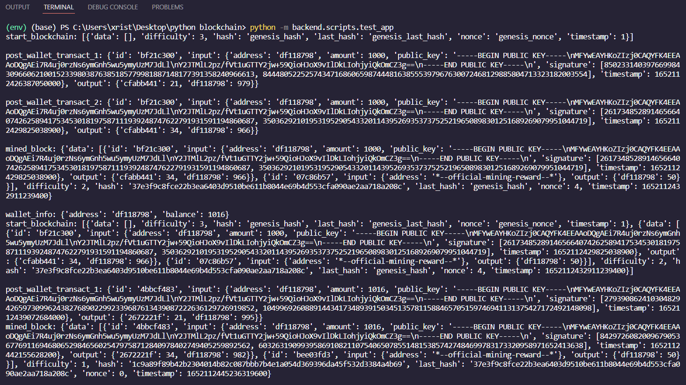
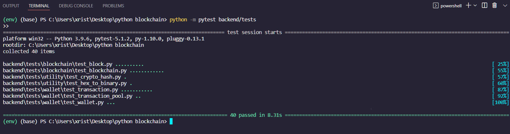

## Fichain | Blockchain & Cryptocurrency App




## Background 📖

Understanding blockchain isn't easy. At least it wasn't for me. 
I had to go through number of frustrations due to a few functional open source examples of how this technology works.
And I like __learning by doing__ so if you do the same, allow me to guide you and by the end you will also have a __functioning blockchain__.
To take it a step further, I connected the blockchain with a __frontend UI__ to provide a solid perception of how blockchains work.


### So, what is blockchain?

Remember that a blockchain is an __immutable__, __sequential__ chain of records called __blocks__. 
The important thing is that they’re chained together using __hashes__.
They can contain transactions, files or __any data__ you like, really! 
It's innovation, is that it guarantees the __transparency__ and __security__ of a record of data,
and generates trust __without__ the need for a trusted __third party__.
The __validation__ of the transactions and therefore the continuation of the (block)chain is called __mining__.


### What about mining?

Each time a __transaction__ is made, it’s broadcasted to the __entire network__. 
Upon hearing the broadcasts, __miners__ take a bunch of transactions, __validate__ that they are “legitimate” — and put them into a block.
The validation is usually accomplished by solving complex __mathematical problems__ to be able to generate the new hash and finally add the new block.
For a __public__ blockchain, the decision to add a transaction to the chain is made by __consensus__. 
This means that __the majority__ of “nodes” (miners) __must agree__ that the transaction is valid. 
The people who own the computers in the network are incentivised to verify transactions through __rewards__. 
This process is known as __‘proof of work’__.

With those in mind, let's dive deeper...


## The application ⛓

This app, aims to demonstrate the above concepts.
As a client while entering the app, we will be taking the role of the __miner__,
and participate in the creation of the blockchain by validating blocks.


### My workflow

- Build the blockchain app with __Python__.

- Implement __dynamic difficulty__ for the mining of new blocks.

- Incorporate the crucial concept of __Proof of Work__ into the blockchain.

- Enhance the application to prepare for __networking__.

- Create the Blockchain network using __Flask__ and __Pub/Sub__.

- Integrate the __Cryptocurrency__, building __Wallets, Keys,__ and __Transactions__.

- Test the app using __Pytest__.

- Extend the __network implementation__ with the cryptocurrency.

- Transition from Python to __JavaScript__ to continue with building the frontend.

- Establish frontend-backend connections and begin coding with __React.js__.

- Create the frontend for the blockchain portion of the system.

- Complete the frontend by building a __UI__ for the cryptocurrency portion of the system.

At this point, there is an initial deployment but there are more actions needed to be made,
in order to deploy both Flask and React subfolders and estabilish a full deployment (propably on Heroku).

Feel free to check the current deployment here:

https://fichain.vercel.app/


## Installation 🛠

First, navigate to the folder where your project will exist:

```
cd <folder_name>
```

Then, clone to the project with the following command:

```
git clone https://github.com/chrisstef/fichain
```


### Virtual Environment

A virtual environment allows us to create an isolated space where our project can install its external packages. 
This is especially helpful when we're managing multiple projects on our machines. 
Separate virtual environments can have different versions of the same package installed - that way,
each project can rely on the versions of their dependencies to stay consistent.

Let's proceed with activating it:

```
.\env\Scripts\activate
```

Our virtual environment called `env` is activated. Moving to backend.


### Backend

Make sure that virtual environment is activated:

```
.\env\Scripts\activate
```

Navigate the to `/backend` directory:

```
cd backend
```

We'll install the requirements coming from `requirements.txt` file with the following command:

```
pip install -r requirements.txt
```

Backend is set up. 


### Frontend

With env activated, navigate to the `/frontend` directory:

```
cd frontend
```
and then:

```
npm install
```


## Run application 🤖

To run the application, we first need to start the flask app (network-backend).
To do so, we have to open a new terminal, activate our virtual environment (env) and type:

```
python -m backend.app
```

If all goes good, our flask app will run on http://127.0.0.1:5000 and the result should be something like this:




On a new terminal, we navigate on our React folder with:

```
cd frontend
```

and then we type:

```
npm start
```

The frontend will run on http://localhost:3000/ and the app is live !!!


Finally, it would be recommended to proceed with some test transactions,
in order to add blocks, store some data and therefore being able to interact with the blockchain.

To do so, on a 3rd terminal activate our virtual environment (env) and type:

```
python -m backend.scripts.test_app
```

This script will create test transactions between known addresses and distribute the
block reward on the nodes. The script runs 4 times, therefore we will have 4 new blocks.




## Run tests ✔

The general approach to tests is to create a series of assert statements that verify whether or not a value is equal to some other value.
Our test were made with `pytest` and in total we made 40 assertions and all of them were successful.

To run the test navigate on the root directory and:

```
python -m pytest backend/tests
```




Finally, there is a last script which demonstrates the average block rate based on the adjusted difficulty mechanism.

Here's the code:

```
python -m backend.scripts.average_block_rate
```


## Command Reference 💻

**Activate the virtual environment**
```
.\env\Scripts\activate
```

**Install all packages**
```
pip install -r requirements.txt
```

**Run the tests**

Make sure to activate the virtual environment.

```
python -m pytest backend/tests
```

**Run the application and API**

Make sure to activate the virtual environment.

```
python -m backend.app
```

**Run the frontend**

In the frontend directory:
```
npm start
```


## Contribution 💡

Thank you for considering to help out with the source code! I welcome contributions from anyone on the internet, 
and am grateful for even the smallest of fixes all the way to your best ideas!
If you'd like to contribute to fichain, please fork, fix, commit and send a pull request to review and merge into the main code base. 


## Acknowledgments 🙏

This project wouldn't have been possible without the help of certain people,
who although unknowingly helped me to understand concepts of Blockchain and Cryptocurrency systems. 
The course link which I took is given below.

https://www.udemy.com/course/python-js-react-blockchain/
